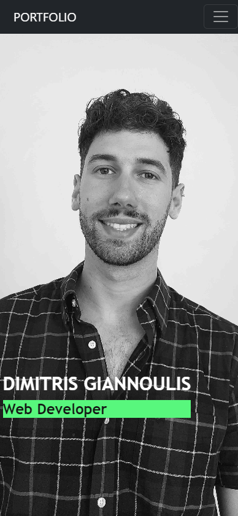
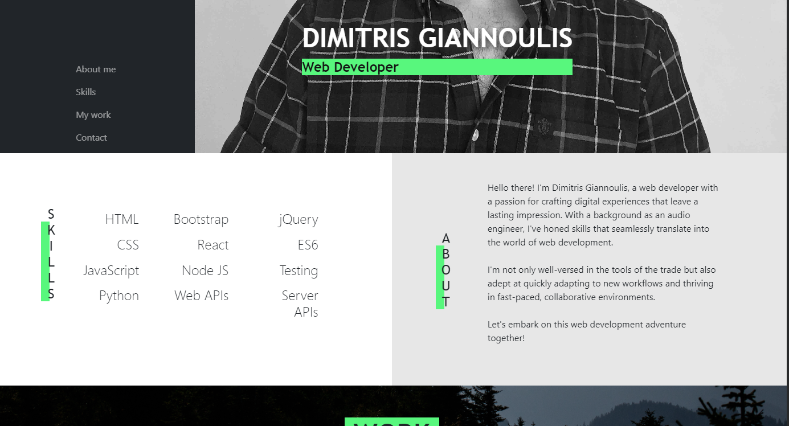
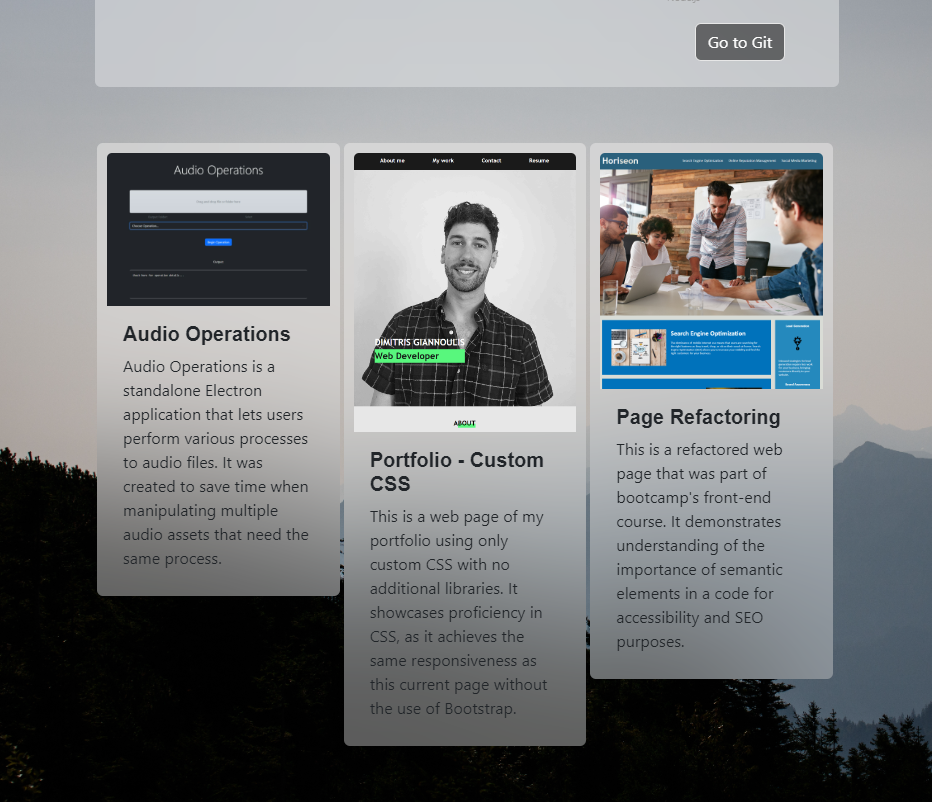

# Dim's Portfolio with Bootstrap 5

This repository houses a web development project that demonstrates a responsive and dynamic portfolio webpage created using Bootstrap 5. This README.md file offers a detailed overview of the project, its motivations, technical implementation details, problems addressed, and insights gained during its development.

## Motivations

1. **Responsive Page Design:** The primary objective of this project was to craft a responsive webpage that seamlessly adapts to various screen sizes and devices. This was accomplished by harnessing the power of Bootstrap 5 while utilizing custom CSS for fine-tuned adjustments to ensure a unique and non-"Bootstrapy" appearance.

2. **Portfolio Showcase:** This site acts as a professional platform for presenting a portfolio of web development projects. HTML and CSS were artfully employed to craft a structured and visually appealing layout that beautifully showcases skills, experience, and past work.

## What Was Done

1. **Leveraging Bootstrap Classes:** The project significantly relied on Bootstrap, an open-source CSS/JS library, to shape the desired page layout. Bootstrap's flexibilities were harnessed to create adaptive and responsive structures, such as the navigation bar and project grid, providing precise control over element placement.

2. **Custom CSS Implementation:** Custom CSS played a vital role in refining Bootstrap's default behavior and adding extra styling to achieve the desired web page layout.

3. **CSS Custom Properties:** The project's color scheme was managed through CSS custom properties (variables). By defining variables for colors, we streamlined design consistency. Modifications to the color palette could be executed by updating these variables, leading to automatic changes across the entire site.

## Problems Addressed

1. **Swift Results:** "Dim's Portfolio with Bootstrap" addresses the need for a rapid, responsive, and stylish solution when crafting a professional and visually appealing online presence. This was achieved through well-structured HTML and CSS in conjunction with Bootstrap 5, resulting in an aesthetically pleasing and informative web page.

2. **Dynamism:** The portfolio webpage was engineered with ease of maintenance in mind. Implementing HTML templates and reusable CSS classes streamlined the addition of new projects and content. This ensures effortless updates and expansions, keeping the portfolio fresh and relevant.

## Insights Gained

Throughout the development of "Dim's Portfolio with Bootstrap," several invaluable technical lessons and skills were acquired:

- **Responsive Web Design:** Profound insights into creating responsive web layouts using media queries, involving adaptive CSS styles based on screen width to ensure content remains accessible and visually appealing on a wide array of devices.

- **Bootstrap Classes:** A deeper understanding of Bootstrap classes was gained, enabling more precise and effective utilization in future projects.

- **Bootstrap Customization:** An understanding of how to alter the behaviour of Bootclass was gained, enabling flexibility in design choices and the avoidance of the "bootstrapy" feeling.

- **Documentation Best Practices:** The project underscored the importance of clear and organized code documentation to enhance collaboration and code maintainability. Emphasis was placed on proper commenting and code structuring practices, facilitating teamwork and future updates.

## Usage

To explore Dim's Portfolio and peruse the showcased web development projects, visit the deployed application at [Dim's Portfolio](https://jimmygian.github.io/portfolio-dimgiannoulis-bs/).

## Credits

This project was conceived, developed, and is actively maintained by Dimitris Giannoulis.

## License

This project is licensed under the MIT License, granting you the freedom to use and modify the code.

## Links
- Deployed application: https://jimmygian.github.io/portfolio-dimgiannoulis-bs/
- Repository: https://github.com/jimmygian/portfolio-dimgiannoulis-bs/
  
Also, check out:
- Portfolio without the use of Bootstrap (previous project): https://jimmygian.github.io/portfolio-dimgiannoulis/
